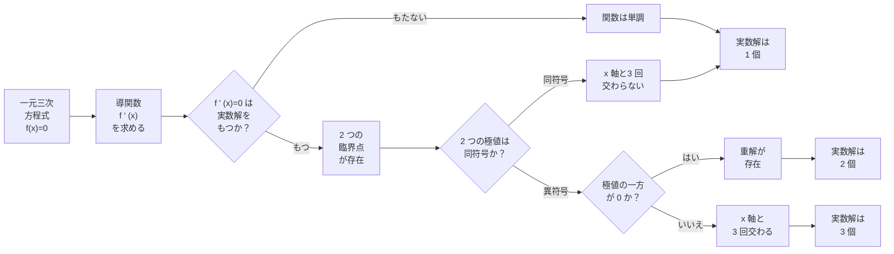

```code
一元三次方程式
```

$$
f(x)=ax^3+bx^2+cx+d \quad (a\neq0)
$$

の **実数解の個数** は，関数の極値と x 軸との位置関係で判定する。

---

#### 基本方針（最重要）

三次関数のグラフは次のいずれかになる。

<span class="imt1">

| 極値の有無 | x軸との関係 | 実数解の個数 |
|:---|:---|:---|
| 極値なし（単調） | 必ず1回交わる | 1個 |
| 極値あり | どちらも同符号 | 1個 |
| 極値あり | **一方が0** | **2個（重解）** |
| 極値あり | **極大値>0 かつ 極小値<0** | **3個** |

---

</span>

#### 導関数と重解の関係（重要）

$f(x)=0$ が **重解をもつ**

$$
\Longleftrightarrow
\text{その解は } f'(x)=0 \text{ も満たす}
$$

つまり，

> **重解は「x軸に接する点」＝ 極値点である**

---

#### 実数解の個数の判定条件

極大値を $M$，極小値を $m$ とすると：

- $M>0$ かつ $m<0$
  → 実数解 **3個**
- $M=0$ または $m=0$
  → 実数解 **2個（重解を含む）**
- $M<0$ または $m>0$
  → 実数解 **1個**

---

#### 判定の手順（テンプレ）

1. $f(x)$ を定める
2. 導関数 $f'(x)$ を求め，極値の $x$ 座標を求める
3. 極大値・極小値を計算する
4. それらの符号（0を含む）から解の個数を判定する

---

#### 例題

$$
x^3-3x-2a=0
$$

の実数解の個数を $a$ の値で分類せよ。

---

#### 解答

$f(x)=x^3-3x-2a$ とおく。

---

##### ① 導関数と極値

$$
f'(x)=3x^2-3=3(x^2-1)
$$

$$
f'(x)=0 \Rightarrow x=\pm1
$$

- $x=-1$：極大値
- $x=1$：極小値

---

##### ② 極大値・極小値

極大値：

$$
f(-1)=2-2a
$$

極小値：

$$
f(1)=-2-2a
$$

---

##### ③ 解の個数の判定

- **3個の実数解**

$$
\begin{cases}
2-2a>0 \\
-2-2a<0
\end{cases}
\Rightarrow -1<a<1
$$

- **2個の実数解（重解を含む）**

$$
\begin{cases}
2-2a=0 \\
\text{または} \\
-2-2a=0
\end{cases}
\Rightarrow a=1,\,-1
$$

- **1個の実数解**

$$
a>1 \quad \text{または} \quad a<-1
$$

---

#### 結論（分類）

| $a$ の範囲 | 実数解の個数 |
|:---|:---|
| $a>1$ | 1個 |
| $a=1$ | 2個（重解） |
| $-1

---

#### 重解のイメージ（重要）

- 重解とは **x軸に接する解**
- グラフが「触れるだけ」で横切らない
- 必ず

$$
f(x)=0 \quad \text{かつ} \quad f'(x)=0
$$

を同時に満たす

---

#### まとめ（試験用暗記）

- 三次方程式の解の個数 → **導関数と極値**
- 重解
  → 極値が **0**
- 三実根
  → 極大値 > 0 かつ 極小値 < 0

---

<span class="imt2">

**「極値が 0」とは何を意味するか（最重要）**

「極値が 0」とは，
**極値をとる点での関数値が 0 である**
という意味である。

これは単に

$$
f(x)=0
$$

という意味ではない。

---

#### 正確な数学的定義

「\(x=a\) において極値が 0」とは，次の **2つを同時に満たす** ことである。

$$
\boxed{
\begin{cases}
f(a)=0 \\
f'(a)=0
\end{cases}
}
$$

- \(f(a)=0\)：
  → 点 \(x=a\) は **原関数の解**（x軸上の点）
- \(f'(a)=0\)：
  → 点 \(x=a\) は **極値点**（接線が水平）

---

#### 図形的な意味（重要）

- \(f(a)=0\) だけ
  → グラフは x軸を **横切る**（通常の解）
- \(f'(a)=0\) だけ
  → 極大値・極小値だが，x軸上とは限らない
- **\(f(a)=0\) かつ \(f'(a)=0\)**
  → グラフは **x軸に接して向きを変える**

これを **重解** という。

---

#### なぜ「極値が 0」だと重解になるのか

重解とは，

> x軸と「交わる」のではなく
> **x軸に「接する」解**

である。

接点では接線が水平になるため，

$$
f'(a)=0
$$

が必ず成り立つ。

---

#### まとめ（試験用に一文で）

> **「極値が 0」とは，
ある数 \(a\) が
原関数 \(f(x)=0\) の解であり，
同時に導関数 \(f'(x)=0\) の解でもあることを意味する。**

---

#### 注意（よくある誤解）

- 「原関数の解が 0」
  ≠ 「極値が 0」
- 「極値が 0」
  ⇒ 必ず **重解**

</span>

